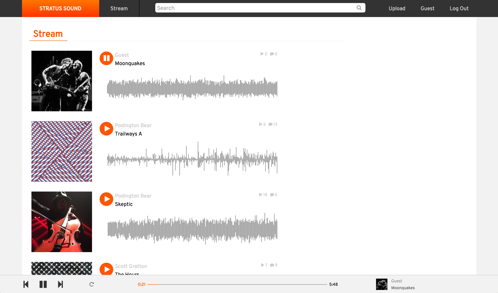
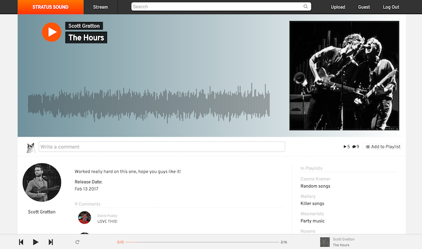
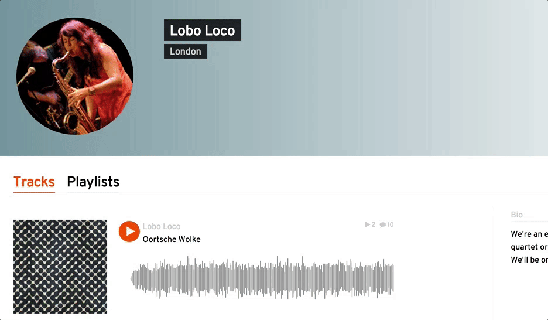

<div align="center">


# ☁️ Stratus Sound

### Plataforma full stack de streaming musical 🎵

<p align="center">
  Stratus Sound es una aplicación web moderna de streaming y compartición de música desarrollada con <b>Ruby on Rails</b>, <b>React</b> y <b>Redux</b>, inspirada en plataformas musicales profesionales.
</p>

<p align="center">
  
  
  
  
  
  
</p>

<p align="center">
  <a href="#-preview">Preview</a> •
  <a href="#-características">Características</a> •
  <a href="#-tecnologías-utilizadas">Tecnologías</a> •
  <a href="#-instalación">Instalación</a> •
  <a href="#-roadmap">Roadmap</a>
</p>

</div>

---

# 🌊 Acerca de Stratus Sound

**Stratus Sound** es una plataforma musical full stack diseñada para streaming, reproducción y compartición de música online.

La aplicación utiliza una arquitectura moderna con:

- ⚙️ Backend en Ruby on Rails
- 🗄️ PostgreSQL como base de datos
- ⚡ Frontend dinámico con React + Redux

El proyecto ofrece reproducción continua, playlists, visualización de waveforms y una experiencia musical moderna inspirada en plataformas premium.

---

# 📸 Preview

<div align="center">



</div>

---

# ✨ Características

# 🎧 Streaming Musical

- ▶️ Reproducción de música online
- ⏯️ Play / Pause
- ⏭️ Next / Previous
- 🔁 Reproducción continua
- 🎵 Cola dinámica de canciones
- 🔊 Audio streaming optimizado

---

# 🎼 Gestión Musical

- ⬆️ Subida de canciones
- ✏️ Edición de tracks
- 🗑️ Eliminación de canciones
- 📂 Gestión de playlists
- 🎤 Perfil de artistas
- 📊 Contador de reproducciones

---

# 🔍 Búsqueda Inteligente

- 🔎 Búsqueda de canciones
- 👤 Búsqueda de usuarios
- 📜 Búsqueda de playlists
- ⚡ pg_search con búsqueda avanzada
- 🎯 Coincidencias parciales inteligentes

---

# 🌊 Audio Waveforms

<div align="center">



</div>

- 📈 Visualización dinámica de audio
- 🎨 Waveforms generados en Canvas
- ⚡ Renderizado optimizado
- 💾 Caché de peaks en base de datos
- 🎵 Sincronización multimedia

---

# 🎶 Playlists & Queue

<div align="center">



</div>

- 📂 Creación de playlists
- ❤️ Organización de canciones favoritas
- 🔄 Queue automática
- ⚡ Cambio fluido entre canciones
- 🎵 Reproducción continua entre páginas

---

# 💬 Comunidad

- 💭 Comentarios en canciones
- 👥 Sistema de usuarios
- 🔒 Login seguro
- 🛡️ Autenticación protegida

---

# 🎥 Playback System

<div align="center">


</div>

- 🎵 HTML5 Audio Engine
- ⌨️ Controles multimedia
- 🔊 Sincronización global
- 🎚️ Barra interactiva
- 🎧 Playback persistente

---

# 🛠️ Tecnologías Utilizadas

## ⚙️ Backend

<p>
  
</p>

- Ruby on Rails
- PostgreSQL
- RESTful API
- BCrypt
- pg_search

---

## 🎨 Frontend

<p>
  
</p>

- React.js
- Redux
- JavaScript
- HTML5
- CSS3

---

## ☁️ Multimedia & Cloud

- Amazon Web Services
- Paperclip
- Audio Streaming APIs
- HTML5 Audio
- Canvas API

---

## 🧰 Herramientas

<p>
  
</p>

- Git & GitHub
- Heroku
- VS Code
- npm
- Webpack

---

# 📂 Estructura del Proyecto

```bash
StratusSound/
│
├── app/                    # Backend Rails
├── frontend/
│   ├── components/         # Componentes React
│   ├── actions/            # Redux actions
│   ├── reducers/           # Redux reducers
│   ├── middleware/         # Middleware
│   └── util/               # Utilidades
│
├── docs/images/            # Capturas y GIFs
├── db/                     # PostgreSQL
└── README.md
```

---

# ⚡ Instalación

## 1️⃣ Clonar el repositorio

```bash
git clone https://github.com/isairey/StratusSound.git
cd StratusSound
```

---

# 🔥 Requisitos

- Ruby 3+
- Rails
- PostgreSQL
- Node.js
- npm
- Yarn

---

# ▶️ Ejecutar Proyecto

## Instalar dependencias backend

```bash
bundle install
```

---

## Instalar frontend

```bash
npm install
```

---

## Configurar base de datos

```bash
rails db:create
rails db:migrate
```

---

## Ejecutar servidor

```bash
rails server
```

---

# 🚀 Funcionalidades Completadas

## ✅ Implementado

- 🎵 Streaming online
- 📂 Playlists
- 🌊 Audio Waveforms
- 💬 Comentarios
- 🔎 Búsqueda avanzada
- 🔄 Playback continuo
- 📊 Contador de reproducciones
- ♾️ Infinite Scroll

---

# 📊 Roadmap

## 🚧 Próximamente

- 👥 Sistema de followers
- 🎯 Feed personalizado
- 🌍 Discover page
- ❤️ Likes y favoritos
- 🎶 Recomendaciones inteligentes
- 📱 Aplicación móvil
- 🤖 Sistema IA musical

---

# 🤝 Contribuciones

Las contribuciones son bienvenidas ❤️

## Pasos para contribuir

1. Haz Fork del proyecto
2. Crea una rama

```bash
git checkout -b feature/nueva-funcion
```

3. Realiza tus cambios
4. Haz commit

```bash
git commit -m "✨ Nueva funcionalidad"
```

5. Haz push

```bash
git push origin feature/nueva-funcion
```

6. Abre un Pull Request 🚀

---

# 👨‍💻 Autor

<div align="center">


## Isai Reyes

Desarrollador Full Stack apasionado por plataformas multimedia, streaming y aplicaciones modernas.

</div>

---

# 🌟 Apoya el Proyecto

Si te gusta Stratus Sound:

⭐ Dale una estrella al repositorio  
🍴 Haz Fork del proyecto  
📢 Compártelo con otros desarrolladores

---

# 📜 Licencia

Este proyecto está bajo la licencia **MIT**.

---

# ⚠️ Disclaimer

> Stratus Sound utiliza servicios multimedia únicamente con fines educativos y tecnológicos.
> Todos los derechos del contenido pertenecen a sus respectivos propietarios.

---

<div align="center">

### ☁️ Stratus Sound — Streaming moderno con tecnología full stack.

</div>
